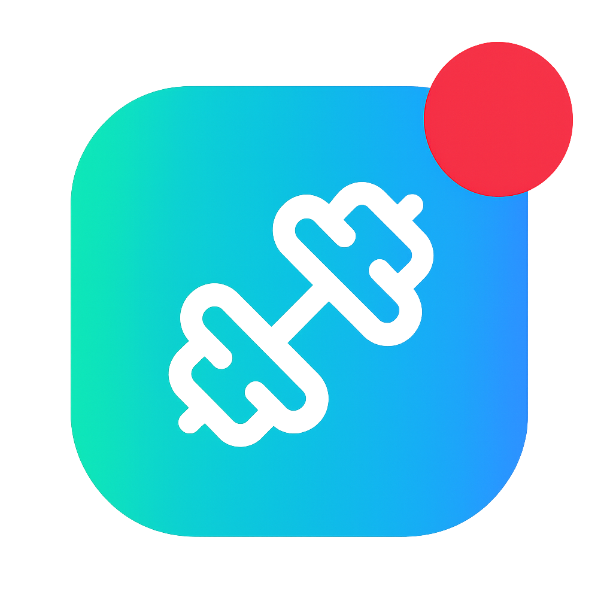

# 🔥 BEASTMODE - Elite Fitness Progress Tracker

[](https://nextjs.org/)
[](https://www.typescriptlang.org/)
[](https://tailwindcss.com/)
[](https://www.framer.com/motion/)

> **UNLEASH YOUR POWER** - Transform your fitness journey with the ultimate progress tracking experience.

Welcome to  **BEASTMODE** Fitness Tracker 🚀

## 🚀 **Overview**

BEASTMODE is a cutting-edge fitness progress tracker designed for warriors who refuse to settle for mediocrity. Built with modern web technologies, it delivers a premium user experience with powerful tracking capabilities, stunning animations, and comprehensive fitness tools.

### ✨ **Key Features**

- 🏋️ **Comprehensive Progress Tracking** - Monitor your fitness journey with detailed analytics
- 📊 **BMI Calculator** - Advanced body composition analysis tools
- 🌙 **Dark/Light Theme** - Seamless theme switching with system preference detection
- 📱 **Fully Responsive** - Optimized for all devices from mobile to desktop
- ⚡ **Lightning Fast** - Built on Next.js 15 with optimal performance
- 🎨 **Premium UI/UX** - Glass morphism design with smooth Framer Motion animations
- 🔥 **Beast Mode Stats** - Real-time tracking of workouts, achievements, and progress

## 🛠️ **Tech Stack**

| Technology | Purpose | Version |
|------------|---------|---------|
| **Next.js** | React Framework | 15.0+ |
| **TypeScript** | Type Safety | 5.0+ |
| **Tailwind CSS** | Styling | 3.0+ |
| **Framer Motion** | Animations | 11.0+ |
| **Lucide React** | Icons | Latest |
| **next-themes** | Theme Management | Latest |

## 🎯 **Live Demo**

Experience BEASTMODE in action: [**Live Demo**](beastmode-fitness-tracker.vercel.app)

## 🚦 **Getting Started**

### Prerequisites

- Node.js 18.0 or higher
- npm, yarn, pnpm, or bun package manager

### Installation

1. **Clone the repository**
   ```bash
   git clone https://github.com/BeastNectus/beastmode-fitness-tracker.git
   cd beastmode-fitness-tracker
   ```

2. **Install dependencies**
   ```bash
   npm install
   # or
   yarn install
   # or
   pnpm install
   # or
   bun install
   ```

3. **Run the development server**
   ```bash
   npm run dev
   # or
   yarn dev
   # or
   pnpm dev
   # or
   bun dev
   ```

4. **Open your browser**
   
   Navigate to [http://localhost:3000](http://localhost:3000) to see BEASTMODE in action!

## 📁 **Project Structure**

```
beastmode-fitness-tracker/
├── src/
│   ├── app/                    # Next.js App Router
│   │   ├── globals.css         # Global styles & utilities
│   │   ├── layout.tsx          # Root layout component
│   │   └── page.tsx            # Home page
│   ├── components/             # Reusable components
│   │   ├── ui/                 # UI components (buttons, etc.)
│   │   ├── sections/           # Page sections
│   │   │   ├── hero-section.tsx
│   │   │   ├── footer-cta.tsx
│   │   │   └── ...
│   │   └── header.tsx          # Navigation header
│   └── lib/                    # Utility functions
│       └── utils.ts
├── public/                     # Static assets
├── components.json             # shadcn/ui configuration
└── ...config files
```

## 🎨 **Features Showcase**

### 🏆 **Hero Section**
- Dynamic BEAST MODE branding with gradient text effects
- Real-time statistics display (25K+ users, 500K+ workouts)
- Smart floating scroll indicator with "scroll down" text
- Premium glass morphism cards with hover animations

### 🌓 **Theme System**
- Automatic dark/light mode detection
- Smooth theme transitions with Framer Motion
- Theme-aware components with consistent styling
- Custom glass-card utilities with proper opacity levels

### 📊 **Progress Tracking**
- Interactive BMI calculator
- Comprehensive workout logging
- Visual progress charts and analytics
- Achievement badges and milestones

### 🎭 **Animations**
- Fluid page transitions with Framer Motion
- Hover effects and micro-interactions
- Scroll-triggered animations
- Loading states and skeleton screens

## 🛠️ **Development**

### Available Scripts

```bash
npm run dev          # Start development server
npm run build        # Build for production
npm run start        # Start production server
npm run lint         # Run ESLint
npm run type-check   # Run TypeScript checker
```

### Environment Variables

Create a `.env.local` file in the root directory:

```env
# Add your environment variables here
NEXT_PUBLIC_APP_URL=http://localhost:3000
```

## 🎨 **Customization**

### Theme Configuration

The app uses Tailwind CSS with custom utilities defined in `globals.css`:

```css
/* Custom gradient utilities */
.fitness-gradient {
  background: linear-gradient(135deg, #00ff88 0%, #00b4db 100%);
}

.fitness-gradient-text {
  background: linear-gradient(135deg, #00ff88 0%, #00b4db 100%);
  -webkit-background-clip: text;
  -webkit-text-fill-color: transparent;
}

/* Glass morphism cards */
.glass-card {
  background: rgba(255, 255, 255, 0.8);
  backdrop-filter: blur(10px);
  border: 1px solid rgba(255, 255, 255, 0.2);
}

.dark .glass-card {
  background: rgba(0, 0, 0, 0.4);
  border: 1px solid rgba(255, 255, 255, 0.1);
}
```

## 📱 **Responsive Design**

BEASTMODE is fully responsive and optimized for:

- 📱 **Mobile** (320px - 768px)
- 📔 **Tablet** (768px - 1024px)
- 💻 **Desktop** (1024px+)
- 🖥️ **Large Screens** (1440px+)

## 🚀 **Deployment**

### Deploy on Vercel (Recommended)

1. Push your code to GitHub
2. Connect your repository to [Vercel](https://vercel.com)
3. Configure environment variables
4. Deploy!

[](https://vercel.com/new/clone?repository-url=https://github.com/BeastNectus/beastmode-fitness-tracker)

### Other Deployment Options

- **Netlify**: Connect your GitHub repository
- **Railway**: One-click deployment
- **DigitalOcean App Platform**: Container-based deployment

## 🤝 **Contributing**

Contributions are welcome! Please feel free to submit a Pull Request.

1. Fork the project
2. Create your feature branch (`git checkout -b feature/AmazingFeature`)
3. Commit your changes (`git commit -m 'Add some AmazingFeature'`)
4. Push to the branch (`git push origin feature/AmazingFeature`)
5. Open a Pull Request

## 📄 **License**

This project is licensed under the MIT License - see the [LICENSE](LICENSE) file for details.

## 👨‍💻 **Developer**

**John Mamanao** - Software Developer  
🐙 GitHub: [@BeastNectus](https://github.com/BeastNectus)

---

<div align="center">

### 🔥 **FORGED FOR LEGENDS** 🔥

*Transform your limits. Unleash your potential. Become LEGENDARY.*

⭐ **Star this repo if you found it helpful!** ⭐

</div>
